# MoniteurConnect — Dossier de conception

### Spécifications fonctionnelles et techniques

**Diffusion**

| Destinataire | Fonction |
| --- | --- |
| Porteur du projet MoniteurConnect | Client |

**De la part de**

| Interlocuteur | Fonction |
| --- | --- |
| Équipe de réalisation | Prestataire |

**Historique des versions**

| Version | Date | Sujet | Auteur |
| --- | --- | --- | --- |
| 0.1 | 13/06/2026 | Version initiale (cadrage MVP) | Équipe de réalisation |
| 0.2 | 16/06/2026 | Ajout candidatures, pièces et contrats | Équipe de réalisation |
| 1.0 | 23/06/2026 | Consolidation fonctionnelle et technique | Équipe de réalisation |

> **Objet du document.** Décrire les fonctionnalités attendues de l'application MoniteurConnect (partie 1), les choix techniques de réalisation (partie 2) et les éléments de recueil du besoin (partie 3). Il complète le [Cahier des charges](CAHIER-DES-CHARGES.md). Les maquettes d'interface citées (« Exemple d'interface ») renvoient au [wireframe basse fidélité](wireframes/index.html).

---

## 1. Spécifications fonctionnelles

MoniteurConnect est un **site d'annonces spécialisé** mettant en relation des **auto-écoles** (qui publient des annonces et gèrent les candidatures) et des **moniteurs indépendants** (qui postulent **sans créer de compte**). Trois acteurs sont identifiés :

- **Visiteur / moniteur** — consulte les annonces et postule, sans compte ;
- **Auto-école** — publie des annonces et gère les candidatures, **compte requis** ;
- **Administrateur** — supervise et modère la plateforme.

### 1.1 Ergonomie générale / Navigation

#### 1.1.a Modèle de page (layout)

Les pages de l'application sont rendues côté serveur (Twig) et reposent sur une mise en page commune en 3 zones :

1. **En-tête** — logo MoniteurConnect et menu horizontal de navigation.
2. **Contenu** — zone principale propre à chaque page.
3. **Pied de page** — informations légales et liens secondaires.

Une zone transversale de **messages (flash)** affiche les retours d'action (succès, erreur, information) en haut du contenu. L'interface est **responsive** (consultable sur mobile, tablette et ordinateur).

*Exemple d'interface — page d'accueil.*

#### 1.1.b Menu horizontal supérieur

Le menu supérieur est **persistant** et **diffère selon l'état d'authentification** :

- **Visiteur (non connecté)** : Accueil · Annonces · Connexion · Inscription.
- **Auto-école (connectée)** : Tableau de bord · Mes annonces · Candidatures · Mon compte · Déconnexion.

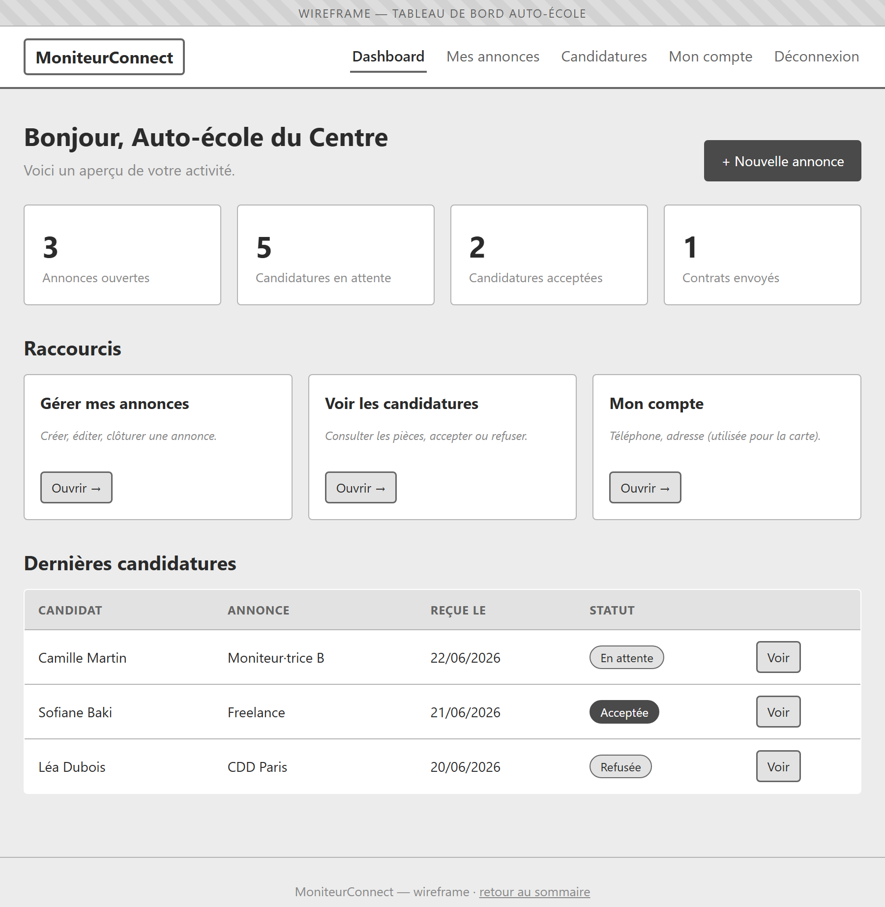

*Exemple d'interface — tableau de bord auto-école.*

#### 1.1.c Séparation des espaces

La navigation distingue clairement **l'espace public** (vitrine + candidature, accessible à tous) de **l'espace auto-école** (tableau de bord, protégé par authentification). Toute tentative d'accès à une page protégée sans session valide redirige vers la page de connexion.

#### 1.1.d Retours utilisateur

Chaque action significative (création, modification, suppression, envoi) produit un **message flash** explicite. Les formulaires réaffichent les **erreurs de validation** champ par champ et **conservent les valeurs saisies** en cas d'échec.

---

### 1.2 Authentification

Acteur principal : **Auto-école** (seul type d'utilisateur authentifié). L'inscription publique de moniteurs n'existe pas : un moniteur postule sans compte (voir §1.4).

#### 1.2.a F1.1 : Inscription d'une auto-école

Un formulaire permet à une auto-école de créer un compte en renseignant : **nom commercial**, **SIRET**, **adresse e-mail** et **mot de passe**. À la création, un e-mail de vérification est envoyé.

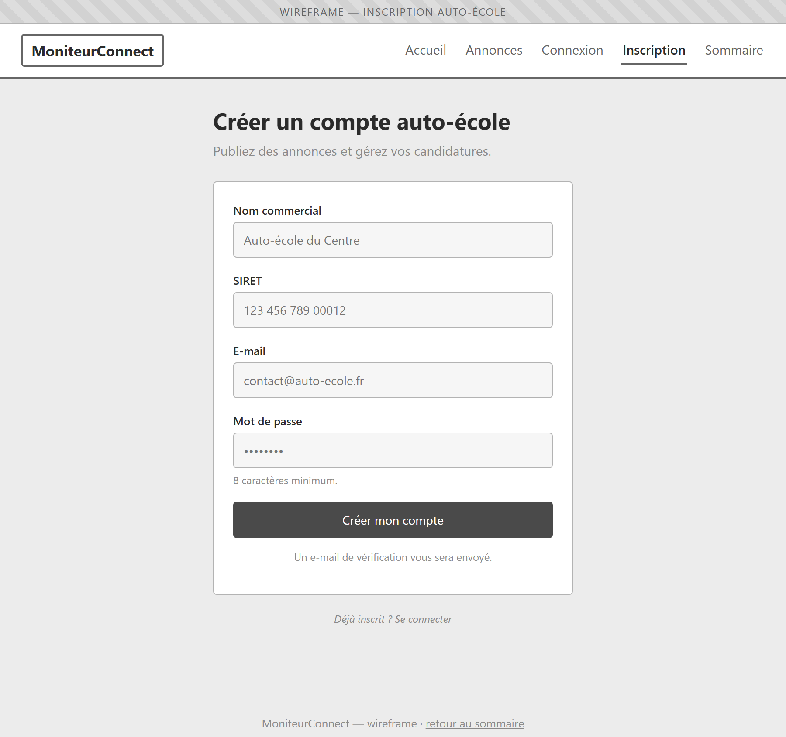

*Exemple d'interface — inscription auto-école.*

**Spécifications**

- **SP1.** L'adresse e-mail et le SIRET sont **uniques** ; un doublon est refusé avec un message explicite.
- **SP2.** Le mot de passe est **haché (bcrypt)** ; sa longueur est bornée pour rester compatible bcrypt (≤ 72 octets).
- **SP3.** Le compte est créé avec l'état `emailVerified = false` ; les fonctions de gestion restent inaccessibles tant que l'e-mail n'est pas vérifié.
- **SP4.** Aucun mot de passe n'est jamais stocké ni journalisé en clair.

#### 1.2.b F1.2 : Vérification de l'adresse e-mail

L'e-mail d'inscription contient un lien à usage unique. Son ouverture active le compte (`emailVerified = true`).

**Spécifications**

- **SP5.** Seul le **hash** du jeton de vérification est stocké en base (`verifyTokenHash`), jamais le jeton en clair.
- **SP6.** Le jeton possède une **date d'expiration** (`verifyTokenExpiry`) ; au-delà, un nouveau lien doit être demandé.

#### 1.2.c F1.3 : Connexion

L'auto-école s'authentifie via un formulaire **e-mail + mot de passe**.

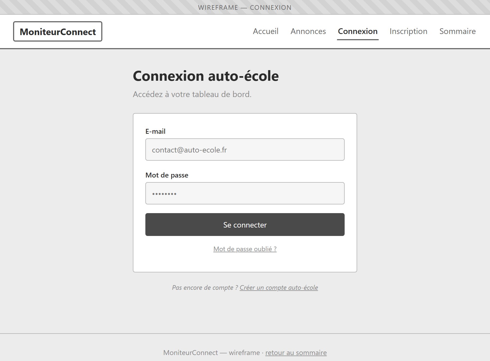

*Exemple d'interface — connexion auto-école.*

**Spécifications**

- **SP7.** Un **message d'erreur générique** est affiché si les identifiants sont incorrects (sans préciser quel champ est erroné).
- **SP8.** La **session est régénérée** à la connexion (protection contre la fixation de session).
- **SP9.** Les tentatives de connexion sont soumises à une **limitation de débit** (rate limiting).

#### 1.2.d F1.4 : Déconnexion

La déconnexion ferme la session et redirige vers une page publique.

#### 1.2.e F1.5 : Mot de passe oublié et réinitialisation

L'auto-école peut demander un lien de réinitialisation par e-mail, puis définir un nouveau mot de passe.

**Spécifications**

- **SP10.** Seul le **hash** du jeton de réinitialisation est stocké (`resetTokenHash`) avec une **expiration** (`resetTokenExpiry`).
- **SP11.** Une **confirmation** du nouveau mot de passe est demandée ; en cas de divergence, un message d'erreur est affiché.
- **SP12.** Pour ne pas divulguer l'existence d'un compte, le message affiché après une demande est **identique**, que l'e-mail existe ou non.

#### 1.2.f F1.6 : Gestion du profil

L'auto-école peut consulter et modifier ses informations de contact.

- **F1.6.1 :** Consulter son profil.
- **F1.6.2 :** Modifier son **téléphone** et son **adresse**.

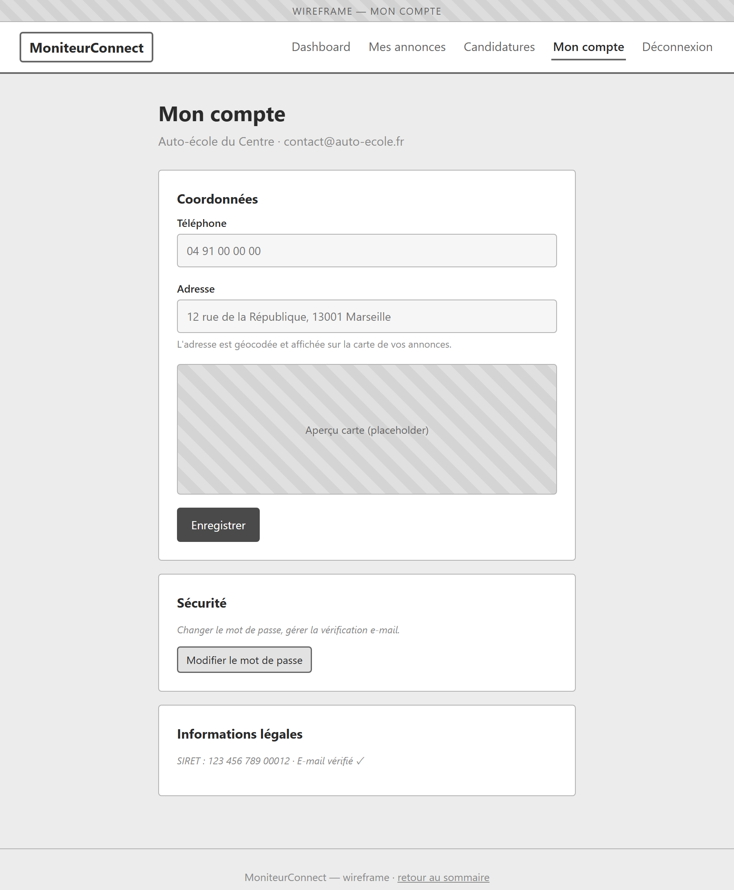

*Exemple d'interface — mon compte.*

**Spécifications**

- **SP13.** Lors d'une modification d'adresse, les **coordonnées géographiques** sont recalculées (re-géocodage, cf. §2.1) pour la carte des annonces.

---

### 1.3 Gestion des annonces

Entité : **Annonce (`Listing`)**. Acteurs : **Auto-école** (gestion) et **Visiteur** (consultation publique).

**Informations relatives à une annonce (attributs)**

- **Titre** : texte court.
- **Description** : texte long.
- **Type de contrat** : CDI, CDD, freelance, apprentissage (optionnel).
- **Ville** et **Département** (code, ex. `13`, `75`, `2A`).
- **Volume horaire** hebdomadaire (optionnel).
- **Rémunération** : texte libre (optionnel).
- **Statut** : `open` (ouverte) ou `closed` (clôturée).
- **Auto-école** : propriétaire de l'annonce (rempli automatiquement).

#### 1.3.a F2.1 : Consulter la liste publique des annonces

Tout visiteur accède à la liste des annonces ouvertes, présentée sous forme de cartes.

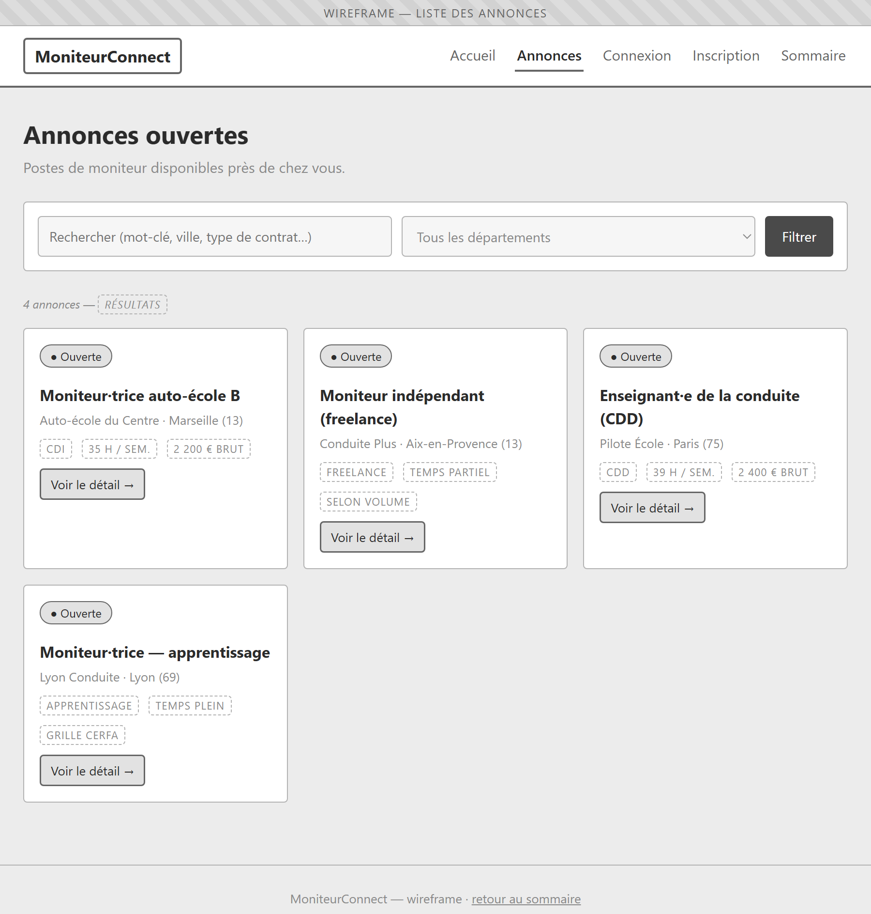

*Exemple d'interface — liste publique des annonces.*

**Spécifications**

- **SP14.** Seules les annonces au statut **`open`** sont visibles publiquement.
- **SP15.** Une **recherche par mots-clés** porte sur le titre / la description / la ville.
- **SP16.** Un **filtre par département** est disponible.

#### 1.3.b F2.2 : Consulter le détail d'une annonce

La page détail présente le poste, l'auto-école et un **formulaire de candidature** (cf. §1.4). Si l'auto-école dispose de coordonnées, une **carte de localisation** (Leaflet / OpenStreetMap) est affichée.

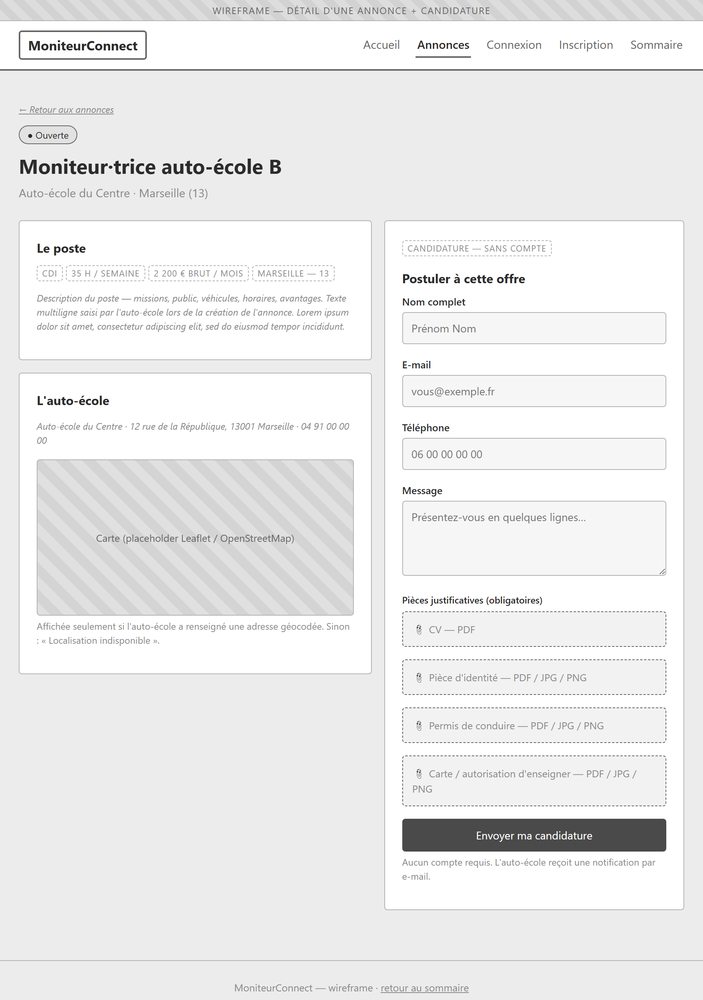

*Exemple d'interface — détail d'une annonce.*

**Spécifications**

- **SP17.** En l'absence de coordonnées, un libellé **« Localisation indisponible »** remplace la carte.

#### 1.3.c F2.3 : Lister ses annonces (auto-école)

L'auto-école visualise ses propres annonces avec leur statut et le nombre de candidatures.

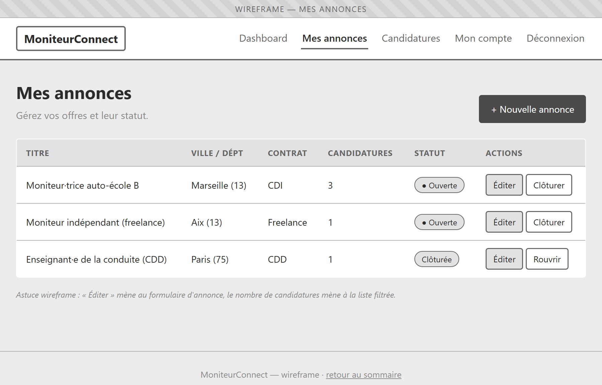

*Exemple d'interface — gestion des annonces.*

#### 1.3.d F2.4 : Créer une annonce

Un formulaire permet de créer une annonce à partir des attributs ci-dessus.

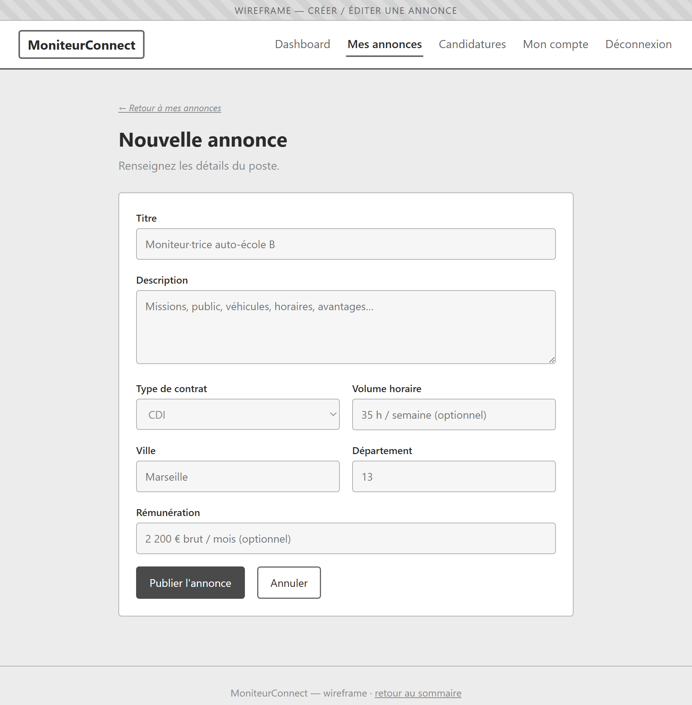

*Exemple d'interface — création / édition d'une annonce.*

**Spécifications**

- **SP18.** Les champs **Titre**, **Description**, **Ville** et **Département** sont obligatoires ; les autres sont optionnels.
- **SP19.** Une annonce est créée au statut **`open`** par défaut.

#### 1.3.e F2.5 : Modifier une annonce

L'auto-école modifie une de ses annonces via un formulaire identique à celui de création.

#### 1.3.f F2.6 : Clôturer / rouvrir une annonce

L'auto-école peut **clôturer** une annonce (passage en `closed`, retrait de la liste publique) ou la **rouvrir**.

#### 1.3.g F2.7 : Supprimer une annonce

L'auto-école peut supprimer une de ses annonces.

**Spécifications (transverses au module)**

- **SP20.** Toutes les opérations de gestion sont **cloisonnées par auto-école** : une école ne peut afficher, modifier ni supprimer que ses propres annonces (contrôle par `schoolId`).
- **SP21.** Les identifiants présents dans les URL sont **validés** avant tout traitement.

---

### 1.4 Gestion des candidatures

Entité : **Candidature (`Application`)**. Acteurs : **Visiteur / moniteur** (dépôt) et **Auto-école** (traitement).

**Informations relatives à une candidature (attributs)**

- **Nom**, **e-mail**, **téléphone** (optionnel) et **message** du candidat.
- **Pièces justificatives** : **CV**, **pièce d'identité**, **permis de conduire**, **carte / autorisation d'enseigner**.
- **Statut** : `pending` (en attente), `accepted` (acceptée) ou `rejected` (refusée).
- **Annonce** rattachée et **contrat** éventuel (relation 1‑1).

#### 1.4.a F3.1 : Déposer une candidature (sans compte)

Depuis la page détail d'une annonce, un moniteur dépose sa candidature via un formulaire, **sans créer de compte**.

*Exemple d'interface — formulaire de candidature (colonne droite).*

**Spécifications**

- **SP22.** Les **4 pièces** (CV, pièce d'identité, permis, carte d'enseignant) sont **obligatoires**. Le CV est attendu au format **PDF** ; les autres pièces en **PDF/JPG/PNG**.
- **SP23.** Chaque fichier fait l'objet d'une **validation du type MIME** et d'une **taille maximale**.
- **SP24.** Les fichiers sont stockés **hors de `public/`**, dans `storage/` (sous-dossiers `cv`, `id`, `license`, `teaching`), avec des **noms régénérés côté serveur**.
- **SP25.** Si l'enregistrement échoue, les **fichiers déjà déposés sont nettoyés** (pas de fichier orphelin).
- **SP26.** Une candidature est créée au statut **`pending`**.

#### 1.4.b F3.2 : Notification de l'auto-école

À la réception d'une candidature, l'auto-école concernée reçoit une **notification par e-mail**.

#### 1.4.c F3.3 : Consulter les candidatures reçues

L'auto-école consulte les candidatures reçues, avec leur statut et l'accès aux pièces.

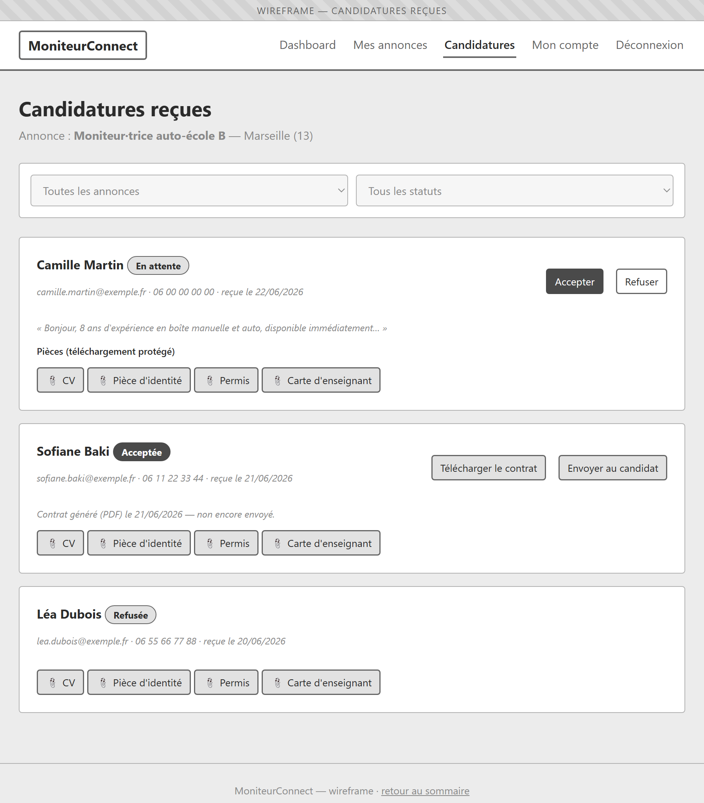

*Exemple d'interface — candidatures reçues.*

#### 1.4.d F3.4 : Télécharger les pièces (accès sécurisé)

L'auto-école télécharge le CV, la pièce d'identité, le permis et la carte d'enseignant d'un candidat.

**Spécifications**

- **SP27.** Les routes de téléchargement sont **protégées** : seules les pièces des candidatures **rattachées à ses propres annonces** sont accessibles à une auto-école.

#### 1.4.e F3.5 : Accepter une candidature

L'acceptation ouvre la saisie d'un contrat (cf. §1.5) et fait passer la candidature au statut **`accepted`**.

#### 1.4.f F3.6 : Refuser une candidature

Le refus fait passer la candidature au statut **`rejected`**.

**Spécifications**

- **SP28.** Si une candidature **précédemment acceptée** est ensuite refusée, le **contrat PDF associé est supprimé**.

---

### 1.5 Contrats

Entité : **Contrat (`Contract`)**, en relation **1‑1** avec une candidature acceptée. Acteur : **Auto-école**.

**Informations relatives à un contrat (attributs)**

- **Type** : freelance, CDI, CDD, apprentissage, générique.
- **Termes** : date de début, date de fin (CDD), motif (CDD), rémunération brute, volume horaire, période d'essai, lieu de travail, SIRET prestataire (freelance), adresses école/candidat, clauses additionnelles.
- **Identité et qualifications du candidat** : date et lieu de naissance, nationalité, n° d'autorisation d'enseigner et validité, n° et catégories de permis.
- **PDF généré** et **date d'envoi** au candidat.

#### 1.5.a F4.1 : Saisir les termes du contrat

À l'acceptation d'une candidature, un formulaire enrichi permet de saisir les termes et les données d'état civil / qualification.

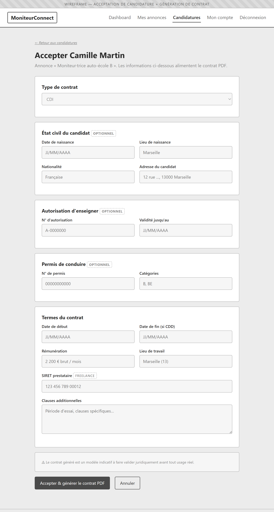

*Exemple d'interface — acceptation et saisie du contrat.*

**Spécifications**

- **SP29.** Le **type de contrat**, la **date de début**, la **rémunération** et le **lieu de travail** sont obligatoires ; les données d'identité et de qualification sont **optionnelles** et n'apparaissent dans le PDF que si elles sont renseignées.

#### 1.5.b F4.2 : Générer le contrat PDF

Le contrat est généré au format **PDF** (PDFKit) selon le type choisi.

**Spécifications**

- **SP30.** Les contrats produits sont des **modèles indicatifs** : un avertissement rappelle qu'ils doivent être **validés juridiquement** avant tout usage réel.
- **SP31.** Pour l'**apprentissage**, le document renvoie au **CERFA officiel** sans reproduire le formulaire officiel.
- **SP32.** Le PDF est stocké dans `storage/contracts/` et n'est accessible qu'à l'auto-école propriétaire.

#### 1.5.c F4.3 : Télécharger le contrat

L'auto-école télécharge le PDF généré (route protégée).

#### 1.5.d F4.4 : Envoyer le contrat au candidat

L'auto-école déclenche **manuellement** l'envoi du PDF au candidat par e-mail ; la date d'envoi est enregistrée (`sentToApplicantAt`).

---

### 1.6 Administration *(prévu — lot ultérieur)*

Acteur : **Administrateur**. Ces fonctions sont **attendues au cahier des charges mais non encore implémentées** ; elles constituent un lot de réalisation ultérieur.

- **F5.1 :** Modérer les annonces.
- **F5.2 :** Modérer les comptes auto-école.
- **F5.3 :** Superviser les candidatures.
- **F5.4 :** Consulter des indicateurs d'activité (tableau de bord).
- **F5.5 :** Gérer les utilisateurs (lister, consulter, suspendre, supprimer).
- **F5.6 :** Gérer la **conservation et la purge** des pièces sensibles (RGPD, cf. §2.5).

---

### 1.7 Matrice des rôles et permissions

| Fonctionnalité | Visiteur | Auto-école | Admin |
| --- | :---: | :---: | :---: |
| **Vitrine / Candidature** | | | |
| Consulter la liste et le détail des annonces | x | x | x |
| Rechercher / filtrer les annonces | x | x | x |
| Déposer une candidature (sans compte) | x | x | – |
| **Authentification** | | | |
| S'inscrire (auto-école) | x | – | – |
| Se connecter / déconnecter | x | x | x |
| Mot de passe oublié / réinitialisation | x | x | x |
| Gérer son profil | – | x | x |
| **Annonces** | | | |
| Lister ses annonces | – | x | x |
| Créer / modifier / clôturer / supprimer une annonce | – | x | x |
| **Candidatures** | | | |
| Consulter les candidatures reçues | – | x | x |
| Télécharger les pièces | – | x | x |
| Accepter / refuser une candidature | – | x | x |
| **Contrats** | | | |
| Saisir / générer / télécharger / envoyer un contrat | – | x | x |
| **Administration** | | | |
| Modérer annonces et comptes | – | – | x |
| Gérer les utilisateurs | – | – | x |
| Gérer la conservation / purge (RGPD) | – | – | x |

*Légende : `x` = autorisé, `–` = non autorisé.*

---

## 2. Spécifications techniques

### 2.1 Technologies utilisées

L'application est de type **web**, en architecture **client-serveur**, accessible depuis un navigateur moderne. Elle utilise un langage serveur, des langages client et une base de données relationnelle.

#### 2.1.a Langage et runtime serveur : Node.js + Express 5

Le serveur applicatif repose sur **Node.js** et le framework **Express 5**, qui gère le routage HTTP, les middlewares (sessions, sécurité, upload) et le rendu des vues.

#### 2.1.b Moteur de rendu : Twig

Les pages sont générées **côté serveur** avec le moteur de templates **Twig** (paquet `twig`). Ce choix favorise des pages simples, indexables et accessibles sans dépendance à un framework front lourd.

#### 2.1.c Accès aux données : Prisma 6

L'accès à la base s'effectue via l'ORM **Prisma 6** (`@prisma/client`). La base est **SQLite en développement** (zéro installation) et la production cible **PostgreSQL** par simple changement de `provider` et de `DATABASE_URL`, sans modification du code applicatif.

#### 2.1.d Langages et bibliothèques client : HTML5, CSS, JavaScript, Leaflet

Les interfaces utilisent **HTML5**, **CSS** et **JavaScript**. La **carte de localisation** d'une auto-école s'appuie sur **Leaflet** et les fonds de carte **OpenStreetMap**, avec les assets embarqués localement.

#### 2.1.e Bibliothèques transverses

| Domaine | Bibliothèque |
| --- | --- |
| Hachage des mots de passe | `bcrypt` |
| Sessions | `express-session` |
| En-têtes de sécurité | `helmet` |
| Limitation de débit | `express-rate-limit` |
| Upload de fichiers | `multer` |
| Envoi d'e-mails | `nodemailer` (fallback console en développement) |
| Génération de PDF | `pdfkit` |
| Géocodage | API **Nominatim** (OpenStreetMap) |
| Configuration | `dotenv` |

---

### 2.2 Architecture logicielle

L'application suit une organisation en couches inspirée du modèle MVC :

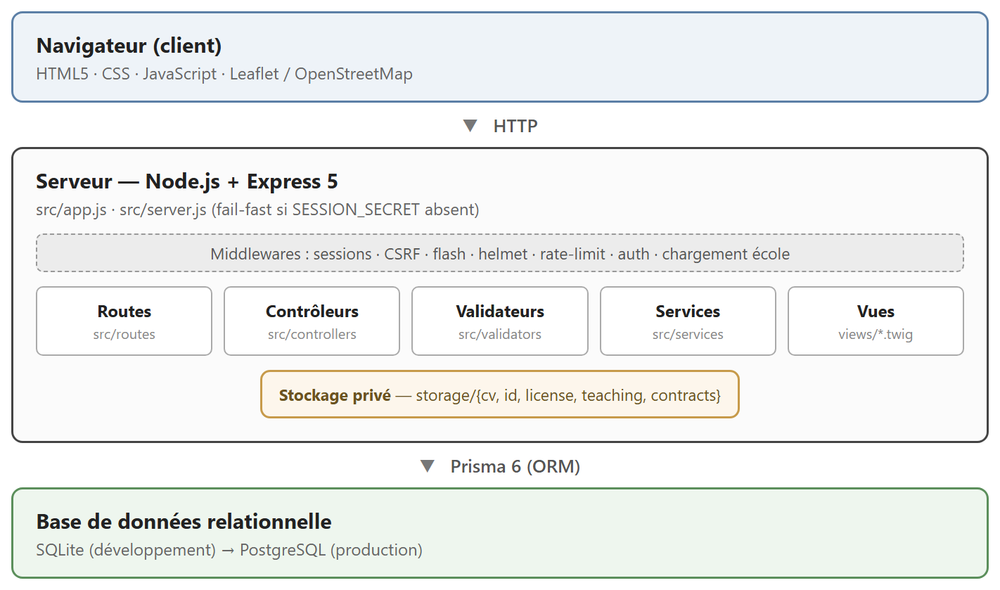

**Principes :** chaque domaine (auth, annonces, candidatures, contrats, compte) a ses routes, son contrôleur et ses services ; les fichiers sensibles sont **isolés hors du dossier public** ; le point d'entrée `src/server.js` applique un **fail-fast** si le secret de session (`SESSION_SECRET`) est absent.

---

### 2.3 Pré-requis techniques

**Environnement serveur**

- **Node.js** (version LTS récente compatible Express 5).
- Base de données : **SQLite** (développement) / **PostgreSQL** (production).
- Service d'envoi d'e-mails **SMTP** en production.

**Variables d'environnement**

| Variable | Rôle |
| --- | --- |
| `SESSION_SECRET` | Secret de signature des sessions (**obligatoire** ; le serveur refuse de démarrer sans). |
| `DATABASE_URL` | Chaîne de connexion à la base (SQLite en dev, PostgreSQL en prod). |
| Paramètres SMTP | Configuration de l'envoi d'e-mails en production. |
| `GEOCODING_DISABLED` | `1` pour désactiver le géocodage de façon déterministe (tests). |

**Navigateurs supportés** : versions récentes de Chrome, Firefox, Edge et Safari, sur ordinateur et mobile (interface responsive).

---

### 2.4 Modèle relationnel de données

Quatre entités principales, gérées par Prisma.

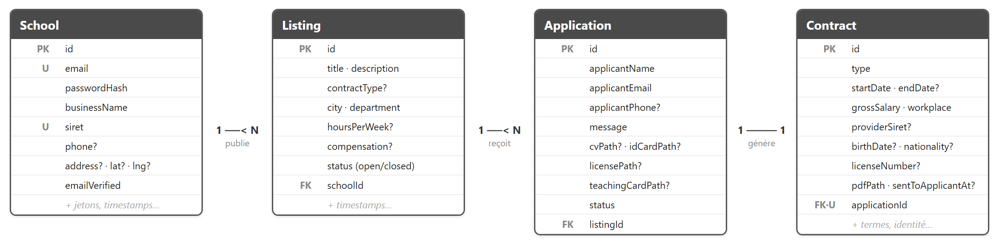

**`School`** — compte auto-école (seul utilisateur authentifié)

| Champ | Type | Notes |
| --- | --- | --- |
| `id` | Int | PK |
| `email` | String | **unique** |
| `passwordHash` | String | bcrypt |
| `businessName` | String | nom commercial |
| `siret` | String | **unique** |
| `phone` | String? | optionnel |
| `address`, `latitude`, `longitude` | String? / Float? | adresse + coordonnées géocodées |
| `emailVerified` | Boolean | défaut `false` |
| `verifyTokenHash` / `verifyTokenExpiry` | String? / DateTime? | vérification e-mail (hash) |
| `resetTokenHash` / `resetTokenExpiry` | String? / DateTime? | réinitialisation (hash) |
| `createdAt`, `updatedAt` | DateTime | horodatage |

**`Listing`** — annonce publiée par une auto-école

| Champ | Type | Notes |
| --- | --- | --- |
| `id` | Int | PK |
| `title`, `description` | String | |
| `contractType` | String? | cdi / cdd / freelance / apprentissage |
| `city`, `department` | String | département indexé |
| `hoursPerWeek` | Int? | |
| `compensation` | String? | texte libre |
| `status` | String | `open` / `closed` (indexé) |
| `schoolId` | Int | FK → School (cascade) |
| `createdAt`, `updatedAt` | DateTime | |

**`Application`** — candidature (déposée sans compte)

| Champ | Type | Notes |
| --- | --- | --- |
| `id` | Int | PK |
| `applicantName`, `applicantEmail` | String | |
| `applicantPhone` | String? | |
| `message` | String | |
| `cvPath`, `idCardPath`, `licensePath`, `teachingCardPath` | String? | chemins privés sous `storage/` |
| `status` | String | `pending` / `accepted` / `rejected` |
| `listingId` | Int | FK → Listing (cascade, indexé) |
| `createdAt` | DateTime | |

**`Contract`** — contrat (relation 1‑1 avec une candidature)

| Champ | Type | Notes |
| --- | --- | --- |
| `id` | Int | PK |
| `type` | String | freelance / cdi / cdd / apprentissage / generic |
| `startDate`, `endDate`, `motif` | DateTime / DateTime? / String? | termes (endDate/motif pour CDD) |
| `grossSalary`, `weeklyHours`, `trialPeriodWeeks` | String / Int? / Int? | |
| `workplace`, `providerSiret` | String / String? | SIRET pour freelance |
| `schoolAddress`, `applicantAddress`, `extraClauses` | String? | |
| `birthDate`, `birthPlace`, `nationality` | DateTime? / String? | état civil |
| `teachingAuthNumber`, `teachingAuthValidUntil` | String? / DateTime? | autorisation d'enseigner |
| `licenseNumber`, `licenseCategories` | String? | permis |
| `pdfPath` | String | chemin privé du PDF |
| `sentToApplicantAt` | DateTime? | date d'envoi au candidat |
| `applicationId` | Int | FK **unique** → Application (cascade) |
| `createdAt`, `updatedAt` | DateTime | |

---

### 2.5 Sécurité et conformité

**Sécurité applicative (en place)**

- Mots de passe **hachés (bcrypt)**, longueur bornée pour compatibilité bcrypt.
- Protection **CSRF** sur les requêtes POST.
- Sessions **HTTP-only**, `sameSite=lax`, `secure` en production ; **régénération** à la connexion.
- En-têtes de sécurité via **helmet** ; **rate limiting** sur les routes sensibles.
- Jetons de vérification / réinitialisation **stockés sous forme de hash** uniquement.
- Identifiants d'URL **validés** ; routes de gestion **cloisonnées par `schoolId`**.
- Fichiers sensibles **hors de `public/`**, **noms régénérés**, **validation MIME** et **taille maximale**, **nettoyage** des fichiers en cas d'échec ; routes de téléchargement **réservées à l'auto-école propriétaire**.

**Conformité RGPD (à approfondir — lot ultérieur)**

L'application traite des **données sensibles** (identité, permis, carte d'enseignant). Restent à mettre en œuvre : **politique de conservation et purge** des pièces, **consentement**, **droits des personnes** (accès, rectification, suppression, export), **mentions légales**.

---

## 3. Recueil du besoin

### 3.1 Glossaire

- **Auto-école** : structure qui publie des annonces et recrute des moniteurs (seul compte authentifié).
- **Moniteur** : enseignant de la conduite, indépendant, qui postule **sans compte**.
- **Annonce (`Listing`)** : offre de poste publiée par une auto-école.
- **Candidature (`Application`)** : réponse d'un moniteur à une annonce, avec pièces justificatives.
- **Contrat (`Contract`)** : document généré à l'acceptation d'une candidature (modèle indicatif).
- **SIRET** : identifiant d'établissement de l'auto-école.
- **CNI** : carte nationale d'identité (pièce d'identité).
- **Carte / autorisation d'enseigner** : titre autorisant l'enseignement de la conduite.
- **Géocodage** : conversion d'une adresse en coordonnées (latitude/longitude) via Nominatim.
- **CERFA** : formulaire administratif officiel (référence pour l'apprentissage).

### 3.2 But final de l'outil

Faciliter le **recrutement de moniteurs** par les auto-écoles via un **site d'annonces spécialisé**, jusqu'à l'établissement d'un **contrat**, **sans** paiement en ligne, planning ni facturation entre les parties. Les questions structurantes ayant guidé le périmètre :

- Comment un moniteur postule-t-il **sans créer de compte** tout en fournissant les pièces nécessaires ?
- Comment garantir la **confidentialité des pièces sensibles** déposées ?
- Comment accompagner l'auto-école **jusqu'au contrat** sans se substituer à un conseil juridique ?

#### 3.2.a Utilisation de données externes (connecteurs, API)

La seule source externe est l'API **Nominatim (OpenStreetMap)** pour le **géocodage** des adresses d'auto-écoles. Aucune autre donnée n'est importée : les annonces et candidatures sont saisies dans l'outil.

### 3.3 Autres besoins spécifiques et points de vigilance

- Les **contrats générés sont indicatifs** et doivent être **validés juridiquement** avant tout usage réel.
- Le traitement de **données sensibles** impose une **vigilance RGPD** particulière (§2.5).
- Le **géocodage Nominatim** convient au MVP ; un fournisseur dédié ou une stratégie de cache sera nécessaire si le trafic augmente.
- La **mise en production PostgreSQL** (variables d'environnement, stockage des fichiers, SMTP, logs, sauvegardes) reste à préparer et tester.
- Mise en production **progressive** : d'abord annonces + candidatures, puis contrats, puis administration et conformité.
