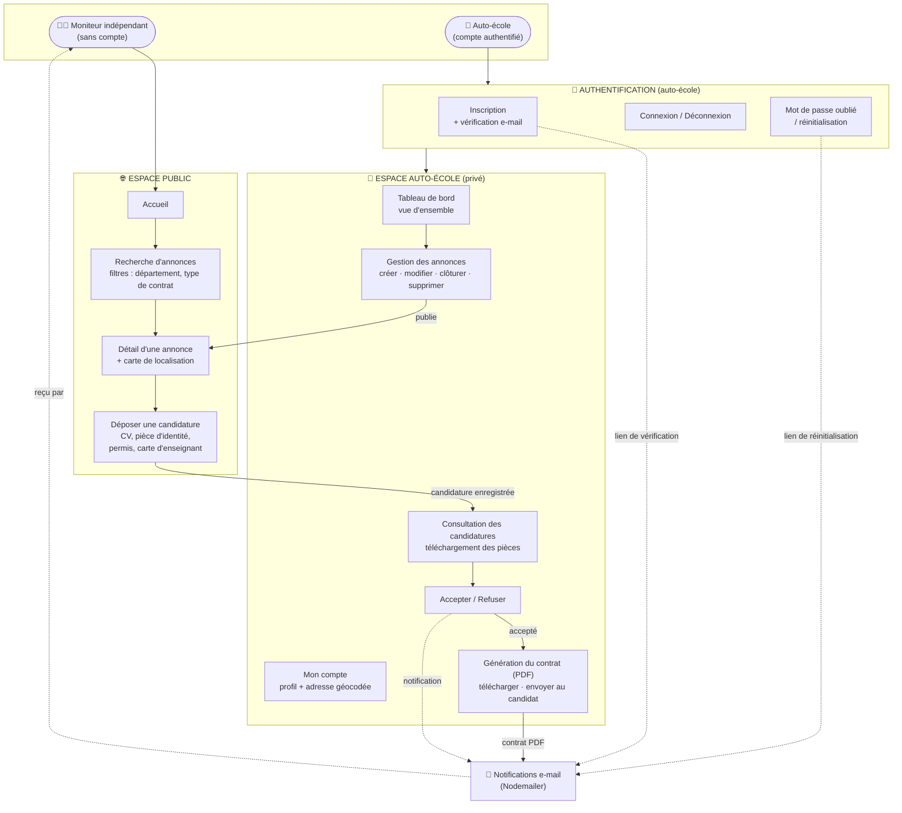
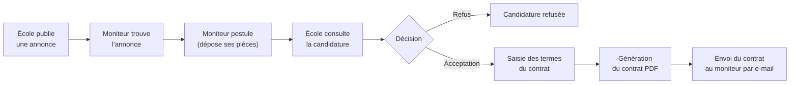
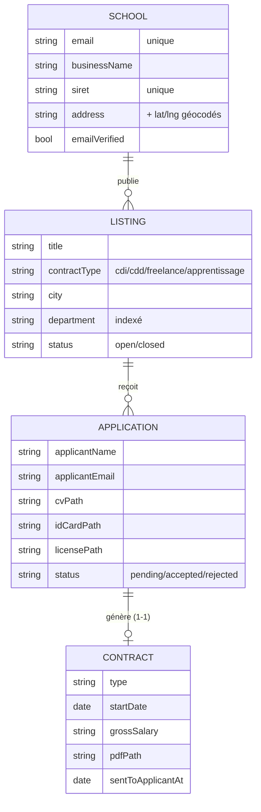
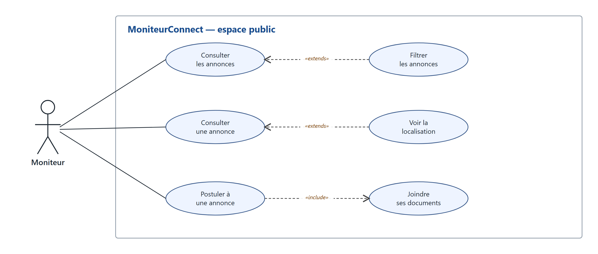
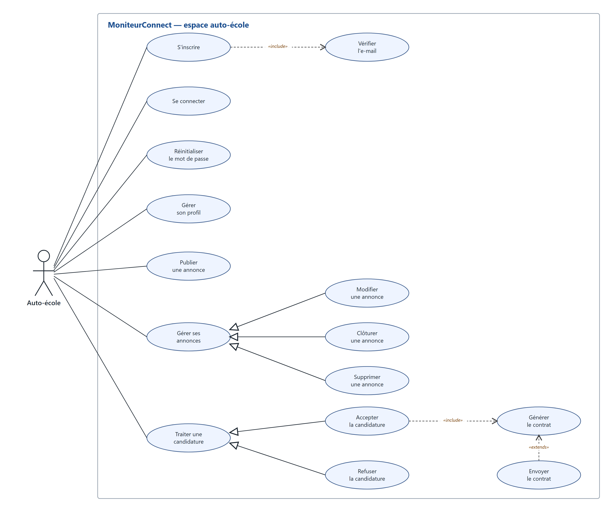

# Diagramme fonctionnel — MoniteurConnect

**MoniteurConnect** est une plateforme d'annonces reliant les **auto-écoles**
(comptes authentifiés) aux **moniteurs indépendants** (qui postulent sans créer
de compte).

---

## 1. Diagramme fonctionnel global



---

## 2. Processus métier central (annonce → recrutement)



---

## 3. Modèle de données (entités)



---

## 4. Architecture technique

Application **Express 5** organisée en MVC (CommonJS) :

```
routes → controllers → services → Prisma (ORM) → SQLite / PostgreSQL
```

| Couche | Rôle | Implémentation |
|--------|------|----------------|
| **Vues** | Rendu HTML | Twig (autoescape activé) |
| **Routes** | Points d'entrée HTTP | `src/routes/` |
| **Middlewares** | Session, CSRF, flash, auth, upload, rate-limit | `src/middlewares/` |
| **Contrôleurs** | Orchestration requête/réponse | `src/controllers/` |
| **Services** | Logique métier (contrats, e-mail, géocodage, jetons) | `src/services/` |
| **Données** | ORM + base | Prisma → SQLite (dev) / PostgreSQL (prod) |

**Sécurité** : Helmet, protection CSRF, sessions httpOnly, rate-limiting
(anti brute-force), hash des mots de passe (bcrypt) et des jetons.

**Briques externes** : génération PDF (**pdfkit**), envoi d'e-mails
(**Nodemailer**), géocodage d'adresses (**Nominatim**), cartes (**Leaflet**).

---

## 5. Diagrammes de cas d'utilisation (UML)

Notation UML : les **acteurs** (bonhommes) sont à l'extérieur du **cadre système**,
les **cas d'utilisation** sont des ellipses (verbe à l'infinitif), reliés par des
**associations** (traits pleins). Les dépendances entre cas utilisent des stéréotypes
`«include»` / `«extends»`, et la **généralisation/spécialisation** un trait plein
terminé par un triangle fermé pointant vers le cas le plus général. Un diagramme par
acteur.

### 5.1 Acteur : Moniteur (espace public)



- **Association** : le moniteur peut *consulter les annonces*, *consulter une annonce*
  et *postuler à une annonce* — sans créer de compte.
- **`«extends»`** (optionnel) : *Filtrer les annonces* étend *Consulter les annonces* ;
  *Voir la localisation* (carte) étend *Consulter une annonce*.
- **`«include»`** (obligatoire) : *Postuler à une annonce* inclut *Joindre ses documents*
  (CV, pièce d'identité, permis, carte d'enseignant).

### 5.2 Acteur : Auto-école (espace authentifié)



- **Association** : *s'inscrire*, *se connecter*, *réinitialiser le mot de passe*,
  *gérer son profil*, *publier une annonce*, *gérer ses annonces*, *traiter une candidature*.
- **`«include»`** : *S'inscrire* inclut *Vérifier l'e-mail* ; *Accepter la candidature*
  inclut *Générer le contrat*.
- **`«extends»`** : *Envoyer le contrat* étend *Générer le contrat* (étape optionnelle).
- **Généralisation / spécialisation** :
  - *Modifier*, *Clôturer* et *Supprimer une annonce* spécialisent *Gérer ses annonces* ;
  - *Accepter* et *Refuser la candidature* spécialisent *Traiter une candidature*.

> Versions imprimables : [`diagramme-cas-utilisation-moniteur.pdf`](diagramme-cas-utilisation-moniteur.pdf)
> · [`diagramme-cas-utilisation-auto-ecole.pdf`](diagramme-cas-utilisation-auto-ecole.pdf).
> Sources éditables (SVG) dans [`../spec-assets/`](../spec-assets/).
