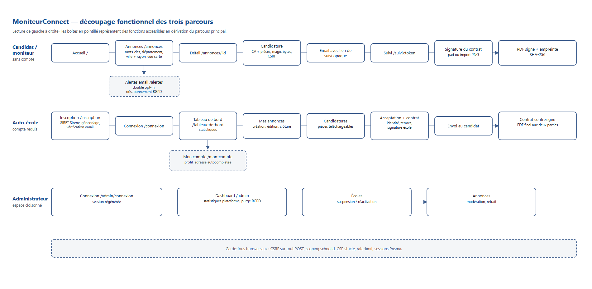
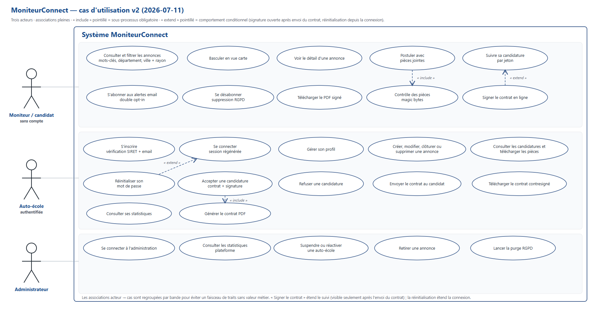
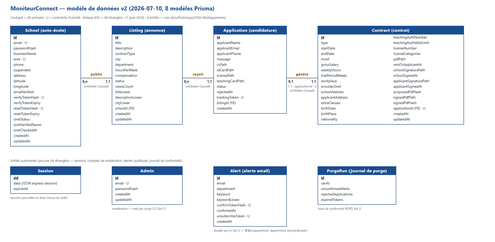

# Diagramme fonctionnel — version 2 (2026-07-11)

Version actualisée du diagramme fonctionnel du 24/06
(`../historique/2026-06/diagrammes/diagramme-fonctionnel.md`, conservé intact
comme preuve de conception). La v1 s'arrêtait avant les lots E → L ; cette v2
décrit l'application réellement livrée.

## 1. Flux global et parcours

Le parcours public conduit le moniteur de la recherche d'une annonce à la
candidature, puis au suivi et à la signature du contrat. Le moniteur ne crée
pas de compte : un jeton opaque reçu par email donne accès à `/suivi/:token`.
L'auto-école dispose d'un espace authentifié pour gérer ses annonces, ses
candidatures, ses contrats et ses statistiques. L'administration est un espace
cloisonné consacré aux statistiques plateforme, à la modération et à la purge
RGPD. La lecture étape par étape est détaillée dans
[`decoupage-fonctionnel.md`](decoupage-fonctionnel.md).

## 2. Cas d'utilisation

Depuis la v1, le périmètre couvre aussi l'administrateur, les alertes email, le
suivi sans compte, la signature électronique, les statistiques et la purge
RGPD. Source vectorielle :
[`diagrammes/cas-utilisation-v2.svg`](diagrammes/cas-utilisation-v2.svg).

## 3. Architecture applicative

L'application suit la chaîne `routes → contrôleurs → services (Prisma) → vues
Twig`. Les points d'entrée de lecture sont `src/app.js`, qui configure Express,
la sécurité, les sessions et le rendu, puis `src/routes/index.js`, qui agrège
les routeurs. Les dossiers réels sont `src/routes/`, `src/controllers/`,
`src/services/`, `src/middlewares/` et `src/views/`.

Les middlewares appliquent transversalement `requireAuth`, `requireAdmin`,
`loadSchool`, le CSRF global — multipart compris —, les sessions persistées par
Prisma et la CSP stricte de Helmet. Deux relais internes évitent les appels
directs depuis le navigateur : `/api/siret/:siret` pour Sirene et
`/api/adresse` pour l'API Adresse. Chacun possède son cache de service et son
rate-limit de route.

## 4. Données

Le modèle livré compte 8 modèles Prisma contre 4 entités dans la v1. La lecture
guidée, les migrations et les procédures de sauvegarde et restauration sont
documentées dans [`base-de-donnees.md`](base-de-donnees.md).

## 5. Processus clés

### Candidature

1. Le candidat dépose son formulaire et ses pièces sur `/annonces/:id/postuler`.
2. Multer limite les fichiers, puis le serveur contrôle leur type réel par magic bytes et vérifie le CSRF multipart.
3. La candidature reçoit un jeton de suivi opaque et est enregistrée avec ses fichiers hors du répertoire public.
4. Deux emails sont tentés sans bloquer la requête : notification à l'école et confirmation au candidat.
5. Le candidat suit ensuite son statut sur `/suivi/:token`.

### Signature du contrat

1. L'école accepte la candidature et renseigne l'identité ainsi que les termes du contrat.
2. Elle signe avec le pad ou un fichier image ; le PDF proposé et son empreinte SHA-256 sont générés.
3. L'école envoie le contrat au candidat, ce qui ouvre la signature depuis le lien de suivi.
4. Le candidat signe à son tour avec le pad ou un import PNG/JPEG contrôlé.
5. Le service produit le PDF final avec les deux signatures et enregistre son empreinte SHA-256 ; une réédition du contrat invalide les artefacts de signature précédents.

### Purge RGPD

1. `src/server.js` appelle `schedulePurge()` : premier passage 30 secondes après le démarrage, puis toutes les 24 heures.
2. La purge supprime les alertes non confirmées anciennes, les candidatures refusées arrivées à échéance avec leurs fichiers et les jetons expirés ; elle ne touche jamais aux candidatures acceptées ni aux contrats.
3. Chaque exécution est journalisée dans `PurgeRun` et la même opération peut être lancée manuellement depuis `/admin`.

## 6. Écarts avec la v1

Le tableau complet « prévu / réalisé » est tenu dans
[`inventaire-documents-historiques.md`](inventaire-documents-historiques.md) ;
les écarts d'écrans dans
[`comparaison-maquettes.md`](comparaison-maquettes.md).
